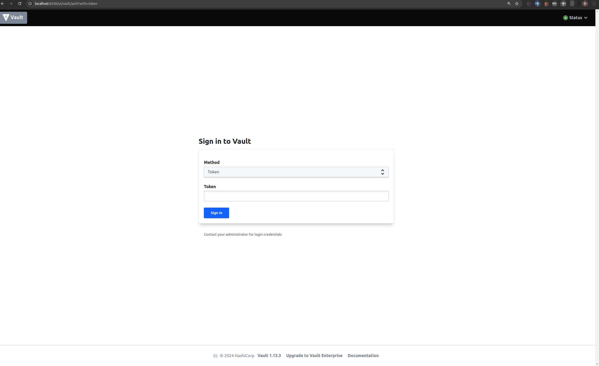
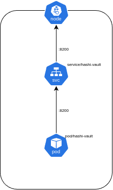

University: [ITMO University](https://itmo.ru/ru/)

Faculty: [FICT](https://fict.itmo.ru)

Course: [Introduction to distributed technologies](https://github.com/itmo-ict-faculty/introduction-to-distributed-technologies)

Year: 2024/2025

Group: K4111c

Author: Sorokin Nikita Alekseevich

Lab: Lab1

Date of create: 2.11.2024

Date of finished: 2.11.2024

---
# 1. Подготовка рабочей станции

Для выполнения лабораторной работы требуется установить пакет программных обеспечений, таких как docker и minikube.

### Docker

Для базовой установки docker были использованы следующие команды:
```
sudo apt update
```

```
sudo apt install apt-transport-https ca-certificates curl software-properties-common
```

```
curl -fsSL https://download.docker.com/linux/ubuntu/gpg | sudo apt-key add -
```

```
sudo add-apt-repository "deb [arch=amd64] https://download.docker.com/linux/ubuntu focal stable"
```

После добавления нового ресурса, проверяем что docker будет установлен из официального репозитория:
```
apt-cache policy docker-ce
```
Вывод команды должен быть следующего вида
```
docker-ce:
  Installed: (none)
  Candidate: 5:19.03.9~3-0~ubuntu-focal
  Version table:
     5:19.03.9~3-0~ubuntu-focal 500
        500 https://download.docker.com/linux/ubuntu focal/stable amd64 Packages
```
Далее устанавливаем сам docker:
```
sudo apt install docker-ce
```
Проверяем активность сервиса:
```
sudo systemctl status docker
```

```
Output● docker.service - Docker Application Container Engine
     Loaded: loaded (/lib/systemd/system/docker.service; enabled; vendor preset: enabled)
     Active: active (running) since Tue 2020-05-19 17:00:41 UTC; 17s ago
TriggeredBy: ● docker.socket
       Docs: https://docs.docker.com
   Main PID: 24321 (dockerd)
      Tasks: 8
     Memory: 46.4M
     CGroup: /system.slice/docker.service
             └─24321 /usr/bin/dockerd -H fd:// --containerd=/run/containerd/containerd.sock
```

В результате данных манипуляций в системе был установлен docker. Но его использование будет требовать постоянных sudo полномочий. Для того чтобы использовать docker без них, требуется использовать следующий набор команд для добавления текущего пользователя в привилегированную группу:
```
sudo usermod -aG docker ${USER}
```

```
su - ${USER}
```

После использования данных команд требуется произвести повторную авторизацию текущего пользователя в системе, после чего docker будет успешно установлен

*Оригинальная инструкция взята с ресурса [DigitalOcean](https://www.digitalocean.com/community/tutorials/how-to-install-and-use-docker-on-ubuntu-20-04)*

### Minikube

Для установки minikube в системе ubuntu требуется ввести следующие команды из [официальной документации](https://minikube.sigs.k8s.io/docs/start/?arch=%2Flinux%2Fx86-64%2Fstable%2Fbinary+download):

```
curl -LO https://storage.googleapis.com/minikube/releases/latest/minikube-linux-amd64
```
```
sudo install minikube-linux-amd64 /usr/local/bin/minikube && rm minikube-linux-amd64
```

После чего minikube будет автоматически установлен в системе

# 2. Запуск кластера

Далее опишем манифест для запускаемого пода c образом [HashiCorp vault](minikube start) и проброшенным портом 8200.

```yml
apiVersion: v1
kind: Pod
metadata:
  name: hashi-vault
  labels:
    name: hashi-vault
spec:
  containers:
  - name: vault
    image: vault:1.13.3
    resources:
      limits:
        memory: "512Mi"
        cpu: "1"
    ports:
      - containerPort: 8200
```

Для создания пода применим команду:
```
kubectl apply -f vault.yml
```

```
pod/hashi-vault created
```

Создадим сервис:
```
minikube kubectl -- expose pod hashi-vault --type=NodePort --port=8200
```

```
service/hashi-vault exposed
```

Пробросим сервис в систему:
```
minikube kubectl -- port-forward service/hashi-vault 8200:8200
```

После чего мы сможем зайти в админ панель приложения через http://localhost:8200/

Далее требуется найти ключ, первоначально он создается при создании пода, поэтому обратимся к логам:
```
kubectl get pods
```

```
NAME          READY   STATUS    RESTARTS   AGE
hashi-vault   1/1     Running   0          7m46s
```

```
kubectl logs hashi-vault
```

Нам требуется найти следующий отрезок:

```
WARNING! dev mode is enabled! In this mode, Vault runs entirely in-memory
and starts unsealed with a single unseal key. The root token is already
authenticated to the CLI, so you can immediately begin using Vault.

You may need to set the following environment variables:

    $ export VAULT_ADDR='http://0.0.0.0:8200'

The unseal key and root token are displayed below in case you want to
seal/unseal the Vault or re-authenticate.

Unseal Key: lmXYKu8Qu3wNT5kBmHd5M8/65Efpf43F0vyxPgB+cPk=
Root Token: hvs.4RJKijScVURpxTTIIsck5EvA

Development mode should NOT be used in production installations!
```

По найденному токену возможно выполнить авторизацию в vault.

В результате была получена следующая схема


# Вывод

В результате выполнения лабораторной работы были установлены docker и minikube. Был описан манифест HashiCorp valut, создан его под, сервис и проброшен порт для доступа с хостовой машины. Так же с помощью инструментов просмотров логов, был найден корневой токен, созданный при запуске приложения.
