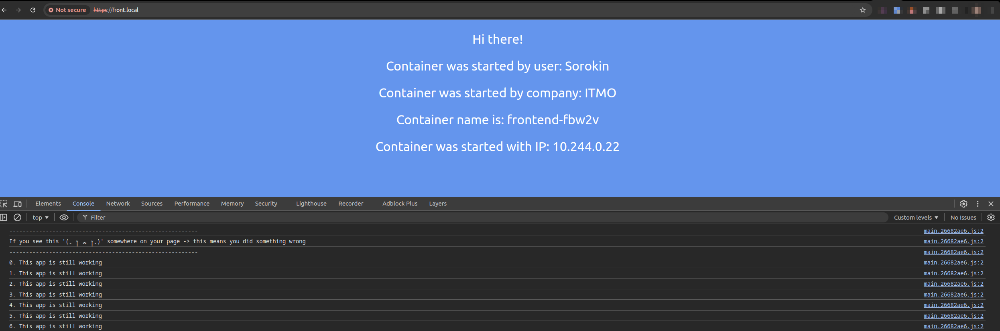
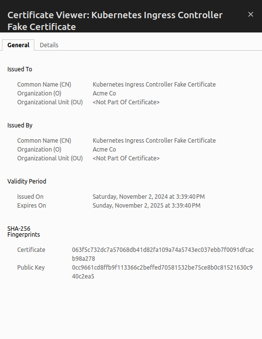
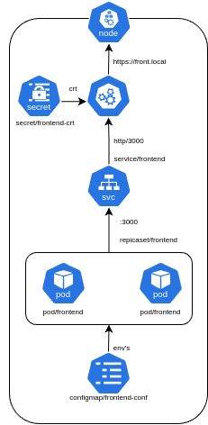

University: [ITMO University](https://itmo.ru/ru/)

Faculty: [FICT](https://fict.itmo.ru)

Course: [Introduction to distributed technologies](https://github.com/itmo-ict-faculty/introduction-to-distributed-technologies)

Year: 2024/2025

Group: K4111c

Author: Sorokin Nikita Alekseevich

Lab: Lab3

Date of create: 2.11.2024

Date of finished: 2.11.2024

---

1. Создадим configMap для переменных окружения
*configmap.yml*
```yml
apiVersion: v1
kind: ConfigMap
metadata:
  name: frontend-conf
data:
  REACT_APP_USERNAME: "Sorokin"
  REACT_APP_COMPANY_NAME: "ITMO"
```
2. Создадим replicaSet

*replicaset.yml*
```yml
apiVersion: apps/v1
kind: ReplicaSet
metadata:
  name: frontend
spec:
  replicas: 2
  selector:
    matchLabels:
      app: frontend
  template:
    metadata:
      labels:
        app: frontend
    spec:
      containers:
      - name: frontend
        image:  ifilyaninitmo/itdt-contained-frontend:master
        resources:
          limits:
            memory: "512Mi"
            cpu: "1"
        envFrom:
          - configMapRef:
              name: frontend-conf
        ports:
        - containerPort: 3000
```

3. Включим аддон minikube:
```
minikube addons enable ingress
```

```
💡  ingress is an addon maintained by Kubernetes. For any concerns contact minikube on GitHub.
You can view the list of minikube maintainers at: https://github.com/kubernetes/minikube/blob/master/OWNERS
    ▪ Using image registry.k8s.io/ingress-nginx/controller:v1.11.2
    ▪ Using image registry.k8s.io/ingress-nginx/kube-webhook-certgen:v1.4.3
    ▪ Using image registry.k8s.io/ingress-nginx/kube-webhook-certgen:v1.4.3
🔎  Verifying ingress addon...
🌟  The 'ingress' addon is enabled
```

4. Создадим сертификат
```
openssl req -x509 -nodes -days 30 -newkey rsa -keyout front.key -out front.crt -subj "/CN=front.local"
```
С помощью данной команды был создан самоподписанный сертификат, действующий 30 дней для целевого адреса `front.local`. В качестве дополнительных параметров были указаны имена ключа и сертификата, поскольку они понадобятся в ingresss

Добавим созданный сертификат в качестве сикрета
```
kubectl create secret tls frontend-crt --cert=front.crt --key=front.key
```

4. Обновляем конфигурацию сервиса

*service.yml*
```yml
apiVersion: v1
kind: Service
metadata:
  name: frontend
spec:
  type: ClusterIP
  selector:
    app: frontend
  ports:
  - port: 3000
    targetPort: 3000
```

Создаем ingress манифест для ingress указывая для него хост и созданный сикрет

*ingress.yml*
```yml
apiVersion: networking.k8s.io/v1
kind: Ingress
metadata:
  name: frontend
  labels:
    name: frontend
spec:
  tls:
    - hosts: 
      - front.local
      secretName: frontend-crt
  rules:
  - host: front.local
    http:
      paths:
      - pathType: Prefix
        path: "/"
        backend:
          service:
            name: frontend
            port: 
              number: 3000
```

5. Добавление DNS записи
Узнаем ip-адрес сервиса

```
minikube ip
```

```
192.168.49.2
```

Добавим новую DNS запись в `/etc/hosts`

```
sudo nano /etc/hosts
```

```
192.168.49.2 front.local
```

6. Запустим все компоненты
```
kubectl apply -f configmap.yml 
```

```
configmap/frontend-conf created
```

```
kubectl apply -f replicaset.yml 
```

```
replicaset.apps/frontend created
```

```
kubectl apply -f service.yml 
```

```
service/frontend configured
```

```
kubectl apply -f ingress.yml
```

```
ingress.networking.k8s.io/frontend created
```


7. Проверяем доступности
Переходим по адрему http://front.local/ и видим что мы используем https с самоподписанным сертификатом





В результате работы получилась следующая схема



# Вывод

В данной лабораторной работе был подключен ingress, написаны манифесты для configmap и replicaset, создан самоподписанный сертификат переданный ingress в качестве сикрета. Реализовано https соединение на адрес https://front.local
