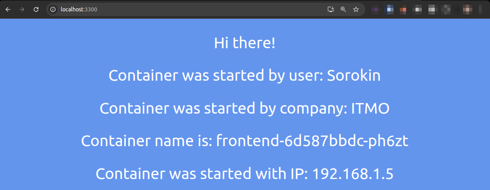
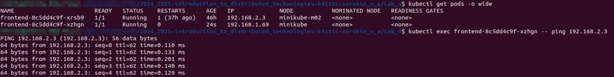

University: [ITMO University](https://itmo.ru/ru/)

Faculty: [FICT](https://fict.itmo.ru)

Course: [Introduction to distributed technologies](https://github.com/itmo-ict-faculty/introduction-to-distributed-technologies)

Year: 2024/2025

Group: K4111c

Author: Sorokin Nikita Alekseevich

Lab: Lab4

Date of create: 2.11.2024

Date of finished: 2.11.2024

---

# Подготовка окружения
Перед началом работы удалим предыдущий контейнер minikube

```
minikube delete
```

Далее запустим minikube со следующими параметрами
```
minikube start --nodes 2 --network-plugin=cni --cni=calico
```

В результате мы получим minikube с двумя нодами под управлением calico

```
kubectl get nodes
```

```
>>>
NAME           STATUS   ROLES           AGE   VERSION
minikube       Ready    control-plane   51s   v1.31.0
minikube-m02   Ready    <none>          33s   v1.31.0
```

```
watch kubectl get pods -l k8s-app=calico-node -A
```

```
>>>
NAMESPACE     NAME                READY   STATUS    RESTARTS   AGE
kube-system   calico-node-flwqk   1/1     Running   0          4m12s
kube-system   calico-node-nj9wv   1/1     Running   0          4m23s
```

# Calico

Укажем для запущенных нод `label` 
```
kubectl label nodes minikube zone=west
```

```
>>> node/minikube labeled
```

```
kubectl label nodes minikube-m02 zone=east
```

```
>>> node/minikube-m02 labeled
```

Напишем манифест для создания пулов ip-адресов для ранее указанных зон

```
apiVersion: crd.projectcalico.org/v1
kind: IPPool
metadata:
  name: zone-west-ippool
spec:
  cidr: 192.168.1.0/24
  ipipMode: Always
  natOutgoing: true
  nodeSelector: zone == "west"

---
apiVersion: crd.projectcalico.org/v1
kind: IPPool
metadata:
  name: zone-east-ippool
spec:
  cidr: 192.168.2.0/24
  ipipMode: Always
  natOutgoing: true
  nodeSelector: zone == "east"


```

Удалим стандартный пул
```
kubectl delete ippools default-ipv4-ippool
```

Добавим пулы из манифеста
```
kubectl apply -n kube-system -f ippools.yaml
```

```
ippool.crd.projectcalico.org/zone-west-ippool created
ippool.crd.projectcalico.org/zone-east-ippool created
```

Проверим пулы в неймспейсе
```
kubectl get ippools -n kube-system
```

```
NAME               AGE
zone-west-ippool   3m16s
zone-east-ippool   3m16s
```

При работе с calico была встречена ошибка при создании пулов, это было связано с неправильным указанием версии API. Для проверки установленной версии была использована команда:

```
kubectl api-versions | grep calico
```

```
crd.projectcalico.org/v1
```

Далее добавим и запустим `configmap`, `deployment` и `service` из прошлых лабораторных работ. 
Пробросим порты сервиса

```
minikube kubectl -- port-forward service/frontend 3300:3000
```

Как можем заметить, мы подключились к поду из зоны `west` так как его ip-адрес в первой подсети.



Протестируем доступность внутри подов

```
kubectl exec frontend-8c5dd4c9f-xzhgn -- ping 192.168.2.3
```




# Вывод

В результате выполнения лабораторной работы был изучен CNI Calico а так же возможность minikube - multinode. Был развернут кластер состоящий из двух нод под управлением calico. Каждой ноде был присвоен ярлык. Были описаны IPpool для каждой ноды и с помощью селектора было указано какой ноде должен применяться пул.
